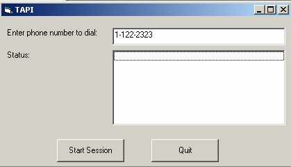



## Sample Telephony Application

### Description

This sample application shows you how you can create telephony application using the TAPI 3.0. You can dial any telephone number from your computer using this application. Read the readme file provided with the application for more information about TAPI.
 
### More Info
 
You must have TAPI installed on your machine

             |
---                |---
**Submitted On**   |2001-07-23 22:04:54
**By**             |[S\.S\. Ahmed](https://github.com/Planet-Source-Code/PSCIndex/blob/master/ByAuthor/s-s-ahmed.md)
**Level**          |Advanced
**User Rating**    |3.9 (31 globes from 8 users)
**Compatibility**  |VB 6\.0
**Category**       |[Internet/ HTML](https://github.com/Planet-Source-Code/PSCIndex/blob/master/ByCategory/internet-html__1-34.md)
**World**          |[Visual Basic](https://github.com/Planet-Source-Code/PSCIndex/blob/master/ByWorld/visual-basic.md)
**Archive File**   |[Sample Tel233877242001\.zip](https://github.com/Planet-Source-Code/s-s-ahmed-sample-telephony-application__1-25410/archive/master.zip)

